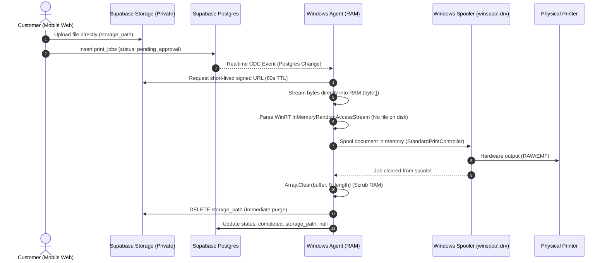

# System Architecture & Topology

## 1. System Topology Overview

Print Infinity 2.0 is a distributed, hybrid web-and-desktop architecture structured across four discrete operational tiers:

```
[Customer Web Portal] (Next.js 14 App Router, Client-Side Validation)
          │
          ▼  HTTPS / REST / Signed URLs
[Cloud Services Tier]
    ├── Next.js Route Handlers (Vercel Serverless)
    ├── Supabase BaaS (Postgres 15, GoTrue Auth, Private Storage, Realtime)
    └── Razorpay Gateway (UPI Orders & HMAC-SHA256 Webhooks)
          │
          ▼  Secure WebSocket (WSS / Postgres Changes CDC)
[Storekeeper PC Runtime] (Windows 10/11)
    ├── Print Infinity Agent (WinUI 3 / .NET 8 Unpackaged Runtime)
    ├── Windows Data Protection API (DPAPI / Windows PasswordVault)
    └── Win32 Spooler Subsystem (winspool.drv / WMI)
          │
          ▼  RAW / EMF Spooler Pipes (USB / Network LAN)
[Physical Hardware Tier] (Printers: Brother, HP, Canon, Epson, POS)
```

---

## 2. Component Boundaries & Responsibilities

### 2.1 Customer Web Client (`/web`)
- **Technology**: Next.js 14.2 (App Router), React 18, Tailwind CSS, TypeScript.
- **Role**: Lightweight, zero-install customer interface loaded via QR code scan at the print shop counter.
- **Core Responsibilities**:
  - Store identification and validation via URL search parameter (`?store=<UUID>`).
  - Document pre-flighting: client-side PDF page calculation (`pdfUtils.ts`), image compression (`imageCompressor.ts`), and MIME validation.
  - Interactive setting configuration (Copies, Duplex, Paper Size, Color Mode, Margins, N-Up sheets).
  - Dynamic pricing estimation based on store-configured per-page rates.
  - Payment initiation via Razorpay Checkout SDK or Cash-at-Counter fallback.
  - Live status tracking over Supabase Realtime using ephemeral `customer_token`.

### 2.2 Cloud API & Persistence Tier (`/supabase` & `/web/src/app/api`)
- **Technology**: Supabase Postgres 15, Supabase GoTrue Auth, Supabase Storage, Next.js Node.js Route Handlers.
- **Role**: Secure mediation layer between unauthenticated customers, payment processors, and authenticated store agents.
- **Core Responsibilities**:
  - Rate limiting (in-memory IP sliding-window: 5 requests/min per IP on job creation).
  - Storage authorization: Uploads into `print-uploads` bucket with a 15-minute auto-expiry (`storage_expires_at`).
  - Strict Row Level Security (RLS) enforcement separating stores and guarding customer files.
  - Change Data Capture (CDC): PostgreSQL Realtime publication emitting insert/update events on `public.print_jobs`.
  - Payment reconciliation: Razorpay order verification and cryptographic HMAC-SHA256 webhook validation.

### 2.3 Windows Native Desktop Agent (`/windows-app`)
- **Technology**: C# .NET 8.0, Windows App SDK 1.5 (WinUI 3), Windows 11 Fluent Design.
- **Role**: Hardened, privacy-enforcing local kiosk agent running on the print shop PC.
- **Core Responsibilities**:
  - Storekeeper authentication via Supabase GoTrue; credentials persisted in Windows `PasswordVault` (fallback: DPAPI `ProtectedData`).
  - Always-on background execution via Windows System Tray (`Shell_NotifyIconW`), suppressing accidental window closes.
  - Persistent WebSocket connection to Supabase Realtime for instant notification of incoming jobs (`JobQueueService.cs`).
  - Dynamic fallback polling timer (30s) that auto-disables when the WebSocket channel is verified healthy.
  - Local printer enumeration, port resolution, and live status querying via Win32 Spooler API (`winspool.drv`) and WMI.
  - Automated printer priority selection and offline device failover.
  - In-memory execution: Direct download of ephemeral signed URL bytes into RAM (`byte[]`), streaming to WinRT `InMemoryRandomAccessStream`, rendering with `Windows.Data.Pdf.PdfDocument`, and silent spooling via `StandardPrintController`.
  - Zero-disk scrubbing: RAM buffer zeroing (`Array.Clear`) and immediate deletion of the cloud storage object upon spool completion.

---

## 3. Data Flow Architecture

### 3.1 The Zero-Disk Streaming Principle
Unlike traditional cloud-print systems that download incoming customer files to `%TEMP%` or `%APPDATA%`, Print Infinity strictly forbids local file persistence:



---

## 4. Trust Boundaries & Security Perimeters

| Zone | Actors | Access Mechanism | Permissions / Boundaries |
| :--- | :--- | :--- | :--- |
| **Public Edge** | Anonymous Customers | Unauthenticated / Web Browser | Can only view active store info. Can upload files into `print-uploads`. Can only read the single `print_jobs` row matching their `x-customer-token`. |
| **Payment Gateway** | Razorpay Servers | Webhook POST with `x-razorpay-signature` | Verified with server-side HMAC-SHA256 secret. Can only advance `pending_payment` jobs to `pending_approval`. |
| **Storefront App** | Storekeeper Web Portal | Supabase GoTrue Auth (JWT) | Access scoped strictly to rows matching `store_id = storekeepers.store_id` via PostgreSQL RLS. |
| **Shop Desktop** | Windows Agent | GoTrue Session + DPAPI / Windows Vault | Full storekeeper privileges for assigned store. Can request 60s signed download URLs for store print jobs. Zero customer document exposure to local disk. |
| **Local Hardware** | Local OS Spooler | Local Service / Administrator | Win32 Spooler API access only. No network egress. |
