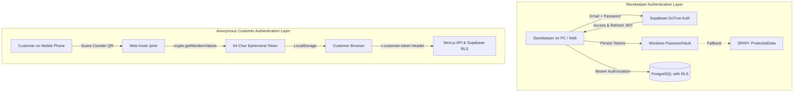

# Authentication & Security Architecture

## 1. Authentication Architecture

Print Infinity implements a dual-layer authentication model tailored to public kiosk and store operator requirements:



### 1.1 Storekeeper Authentication (Operator Level)
- Handled by **Supabase GoTrue** (`auth.users`).
- On first launch or registration, the storekeeper enters credentials.
- The desktop agent validates the session directly with Supabase (`client.Auth.SignIn` or `client.Auth.SignUp`).
- The active session is stored locally using the **Windows Credential Locker** (`Windows.Security.Credentials.PasswordVault`).
- If `PasswordVault` is inaccessible, the agent falls back to **Windows DPAPI** (`ProtectedData.Protect` using `DataProtectionScope.CurrentUser` with a localized entropy salt), ensuring tokens are only decryptable by the active Windows user.
- On subsequent launches, `SupabaseAuthService.TryRestoreSessionAsync()` validates the stored token against Supabase. If valid, the user enters directly; if expired or revoked, the agent securely resets to the login screen.

### 1.2 Customer Authorization (Anonymous Kiosk Level)
- Customers do not create accounts or enter passwords.
- Upon opening `/print`, `tokenManager.ts` generates a cryptographically random 256-bit token (64-char hexadecimal string):
  ```typescript
  const array = new Uint8Array(32);
  window.crypto.getRandomValues(array);
  const token = Array.from(array, b => b.toString(16).padStart(2, "0")).join("");
  ```
- Every subsequent query (`GET /api/print-jobs/status` or Supabase REST queries) transmits this token via the `x-customer-token` header.
- PostgreSQL RLS policies restrict anonymous `SELECT` queries strictly to rows where `customer_token = request.headers->>'x-customer-token'`. Customers can never see or modify jobs from other customers or other stores.

---

## 2. Zero-Disk Privacy Policy

The Zero-Disk Privacy Policy guarantees that no customer document is ever accessible to third parties, store personnel, or the shop PC's persistent storage:

| Stage | Security Control | Technical Mechanism |
| :--- | :--- | :--- |
| **1. Upload** | Private Bucket Only | Files are saved to `print-uploads` bucket (`public = FALSE`). Direct URLs return `403 Forbidden`. |
| **2. Storage TTL** | Automatic 15-min Expiration | `print_jobs.storage_expires_at` is set to `NOW() + 15 minutes`. Abandoned files are auto-purged by `expire_outdated_print_jobs()`. |
| **3. Access** | Ephemeral Signed URLs | The desktop agent generates short-lived signed URLs with a **60-second TTL** strictly at the moment of printing. |
| **4. Ingestion** | In-Memory Streaming | The agent downloads bytes directly into a RAM buffer (`byte[]`). It is never written to disk, `%TEMP%`, or cache directories. |
| **5. Rendering** | WinRT In-Memory Stream | Documents are loaded via `InMemoryRandomAccessStream` directly into `Windows.Data.Pdf.PdfDocument`. |
| **6. RAM Scrubbing** | Cryptographic Buffer Zeroing | Immediately after the spooler accepts the job, `Array.Clear(inMemoryBuffer, 0, inMemoryBuffer.Length)` zeroes the memory before garbage collection. |
| **7. Cloud Purge** | Immediate File Deletion | The agent issues a `Storage.Remove([storage_path])` call, physically deleting the document from Supabase Storage. |
| **8. Audit Trails** | Text-Only Metadata Logs | The agent's audit log strictly records timestamp, page count, copies, and status (`AuditLogEntry.cs`). Previews, thumbnails, and filenames are never retained. |

---

## 3. Webhook Security & Tamper Resistance

### 3.1 Razorpay Webhook Authentication
- In `web/src/app/api/payment/webhook/route.ts`, incoming payloads are validated using constant-time cryptographic comparison:
  ```typescript
  const expectedSignature = crypto
    .createHmac("sha256", RAZORPAY_WEBHOOK_SECRET)
    .update(rawBody)
    .digest("hex");

  if (!crypto.timingSafeEqual(Buffer.from(signature), Buffer.from(expectedSignature))) {
    return NextResponse.json({ error: "Invalid signature" }, { status: 401 });
  }
  ```
- Protects against replay attacks, timing analysis, and unauthorized status tampering.

### 3.2 Idempotency Guards
- The database RPC `verify_payment_and_advance_job` guards against race conditions where a delayed webhook arrives after a storekeeper has already approved or printed an order:
  ```sql
  IF v_job.status = 'pending_payment' THEN
      UPDATE public.print_jobs
      SET status = 'pending_approval'
      WHERE id = p_print_job_id;
  END IF;
  ```
  Status never regresses backward from `approved`, `printing`, or `completed`.

---

## 4. API Rate Limiting & Input Sanitization

- **Rate Limiting**: Sliding-window IP limiter on `POST /api/print-jobs/create` (5 requests / 60s per IP) to mitigate denial-of-service and storage exhaustion.
- **Input Validation**:
  - UUID validation on `store_id`.
  - Extension whitelist on `storage_path` (`pdf, png, jpg, jpeg, webp, doc, docx, ppt, pptx, xls, xlsx, txt, rtf`).
  - Strict integer clamps: `copies` (1–100), `page_count` (1–2000), `amount` (₹0.01–₹10,000).
