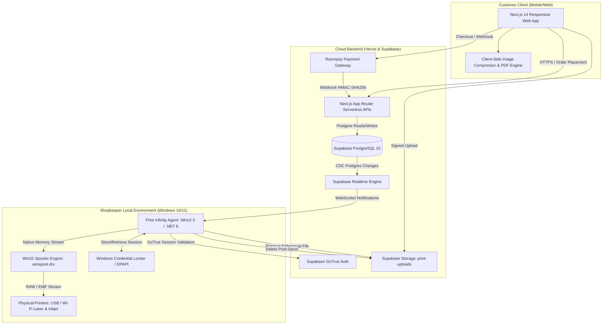

# Print Infinity 2.0 — System Brain & Master Index

> **Platform Overview**: Privacy-first, cloud-to-hardware print kiosk platform. Customers scan a store-specific QR code, configure detailed print settings, upload documents via mobile/desktop web, and pay (Razorpay UPI or Cash). The native Windows Desktop Agent running on the shop PC intercepts jobs via Supabase Realtime, loads documents directly into memory (zero-disk persistence), spools them to local printers via Win32 APIs, verifies hardware output, and immediately purges files from RAM and cloud storage.

---

## 1. System Map & Topic Navigation

| Document | Scope & Contents | Primary Code References |
| :--- | :--- | :--- |
| **[Architecture](./architecture.md)** | End-to-end multi-tier topology, data flow, component boundaries, and security perimeters. | Full repository |
| **[Directory Map](./directory_map.md)** | Complete repository file hierarchy, module taxonomy, and responsibility matrix. | `web/`, `windows-app/`, `supabase/` |
| **[Workflows](./workflows.md)** | Step-by-step lifecycles: Order placement, payment routing, agent spooling, fallback, cleanup. | `PrintWizard.tsx`, `PrintPipelineService.cs` |
| **[Frontend](./frontend.md)** | Next.js 14 App Router, 6-step state machine, UI component tree, admin portal. | `web/src/app/`, `web/src/components/` |
| **[Backend APIs](./backend_api.md)** | Next.js Route Handlers, IP rate limiting, input validation, HMAC signature checks, idempotency. | `web/src/app/api/` |
| **[Database](./database.md)** | PostgreSQL schema, Row Level Security (RLS), stored procedures/RPCs, triggers, storage bucket. | `supabase/migrations/` |
| **[Windows Agent](./windows_agent.md)** | WinUI 3/.NET 8 native agent, Win32 spooler P/Invoke, PDF rendering, background system tray. | `windows-app/PrintInfinity.Agent/` |
| **[Auth & Security](./auth_security.md)** | GoTrue JWT, Windows DPAPI/Credential Locker, customer tokens, Zero-Disk privacy enforcement. | `SupabaseAuthService.cs`, `tokenManager.ts` |
| **[Integrations](./integrations.md)** | External/native drivers: Supabase (DB/Auth/Realtime), Razorpay (Orders/Webhooks), Windows Spooler. | `supabaseClient.ts`, `WindowsPrintEngine.cs` |
| **[Deployment](./deployment.md)** | Vercel deployment, self-contained Windows Agent installer/packaging, environment variables. | `reinstall_agent.ps1`, `vercel.json` |
| **[Testing & Performance](./testing_performance.md)** | E2E simulations, socket pooling, UI virtualization, WMI polling throttling, resilience matrix. | `scratch/`, `PrintPipelineService.cs` |
| **[Conventions](./conventions.md)** | Architectural patterns, naming schemes, C#/TypeScript idioms, and error handling rules. | Codebase standards |

---

## 2. High-Level Technology Stack

---

## 3. Core Architectural Principles

1. **Zero-Disk In-Memory Streaming**: Customer documents are NEVER written to the shopkeeper's physical hard drive (`C:\`, `%TEMP%`, or AppData). They are downloaded directly into an in-memory byte buffer (`byte[]`), streamed into WinRT `InMemoryRandomAccessStream`, spooled directly to `winspool.drv`, and the byte array is wiped with `Array.Clear` immediately after transmission.
2. **Instant Storage Ephemerality**: Cloud files in the private bucket `print-uploads` have a maximum 15-minute expiration time. Once spooled by the desktop agent, an immediate API deletion request is issued.
3. **Dual-Channel Payment & Idempotency**: Support for automated Razorpay UPI and manual Pay at Counter (Cash). All payment verification handlers use database-level idempotency guards preventing state regression.
4. **Resilient Hardware Routing**: The agent tracks printer health (< 0.1ms Win32 checks). If a primary printer is offline, it automatically routes jobs to configured fallback devices of matching color capabilities without failing the order.
5. **Strict Access Boundaries**: Customers access only their order via a cryptographically random 64-character token (`x-customer-token`). Storekeepers access only their assigned store via authenticated Supabase GoTrue JWT.
