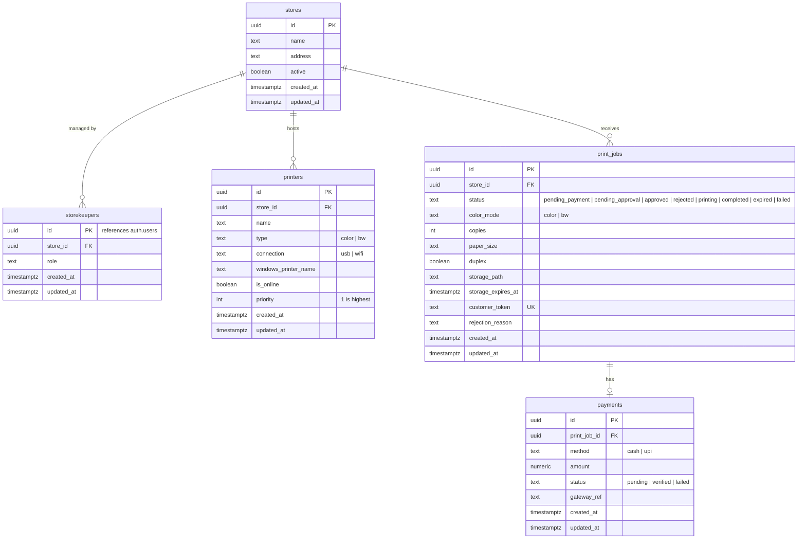

# Database Schema, RLS & Storage Specifications

## 1. Relational Schema Entity-Relationship Diagram



---

## 2. Table Definitions & Constraints

### 2.1 `public.stores`
- Primary representation of a physical print shop.
- Column `active`: Boolean flag controlling whether new customer jobs can be submitted.

### 2.2 `public.printers`
- Hardware printer registry synced from shopkeeper PCs.
- `type`: `CHECK (type IN ('color', 'bw'))`.
- `connection`: `CHECK (connection IN ('usb', 'wifi'))`.
- `priority`: Integer column (1 = Primary/Default; 2, 3... = Fallback devices).

### 2.3 `public.print_jobs`
- Core operational entity tracking print requests.
- `customer_token`: Unique 64-char string permitting anonymous customer query access.
- `storage_path`: Ephemeral cloud storage path, cleared to `NULL` upon successful spooling.
- `storage_expires_at`: Expiration timestamp (15 min post-creation) for automated cleanup.

### 2.4 `public.payments`
- Financial record tracking either online payment or cash at counter.
- `method`: `CHECK (method IN ('cash', 'upi'))`.
- `status`: `CHECK (status IN ('pending', 'verified', 'failed'))`.

---

## 3. Row Level Security (RLS) Matrix

RLS is enabled on **every table** in `public`:

```sql
ALTER TABLE public.stores ENABLE ROW LEVEL SECURITY;
ALTER TABLE public.printers ENABLE ROW LEVEL SECURITY;
ALTER TABLE public.print_jobs ENABLE ROW LEVEL SECURITY;
ALTER TABLE public.payments ENABLE ROW LEVEL SECURITY;
ALTER TABLE public.storekeepers ENABLE ROW LEVEL SECURITY;
```

| Table | Operation | Role | Policy Rule / Predicate |
| :--- | :---: | :--- | :--- |
| `stores` | `SELECT` | `anon` | `active = TRUE` |
| `stores` | `SELECT` | `authenticated` | Assigned storekeeper matches `store_id` |
| `printers` | `ALL` | `authenticated` | `EXISTS (SELECT 1 FROM storekeepers WHERE storekeepers.id = auth.uid() AND storekeepers.store_id = printers.store_id)` |
| `print_jobs` | `INSERT` | `anon, authenticated` | `WITH CHECK (true)` (Anyone can submit an order) |
| `print_jobs` | `SELECT` | `anon` | `customer_token = COALESCE(request.headers->>'x-customer-token', request.jwt.claims->>'customer_token')` |
| `print_jobs` | `SELECT, UPDATE` | `authenticated` | Storekeeper belongs to the job's `store_id` |
| `payments` | `INSERT` | `anon, authenticated` | `WITH CHECK (true)` |
| `payments` | `SELECT` | `anon` | Belongs to a job matching customer's `x-customer-token` |
| `payments` | `SELECT, UPDATE` | `authenticated` | Storekeeper belongs to the payment's `store_id` |

---

## 4. Stored Procedures & RPC Functions

### 4.1 `approve_print_job(p_print_job_id, p_rejection_reason)`
- **Security**: `SECURITY DEFINER`
- Updates `print_jobs.status = 'approved'`.
- Automatically marks corresponding payment record `status = 'verified'` (for cash counter verification).

### 4.2 `verify_payment_and_advance_job(p_print_job_id, p_customer_token, p_gateway_ref)`
- **Security**: `SECURITY DEFINER`
- Idempotently verifies `payments.status = 'verified'`.
- Advances `print_jobs.status` to `pending_approval` **only if** still in `pending_payment`, preserving any downstream states (`approved`, `printing`, `completed`).

### 4.3 `get_customer_print_job(p_customer_token)`
- **Security**: `SECURITY DEFINER`
- Allows anonymous client to securely look up their active job record using only their token without exposing other stores or jobs.

### 4.4 `expire_outdated_print_jobs()`
- **Security**: `SECURITY DEFINER`
- Updates all jobs where `storage_expires_at < NOW()` and `status NOT IN ('completed', 'expired')` to `expired`. Can be invoked via `pg_cron` or Supabase Edge Functions.

---

## 5. Storage Bucket Configuration (`storage.buckets`)

- **Bucket ID**: `print-uploads`
- **Public**: `FALSE` (Private bucket; files are never accessible via raw public URL).
- **Max File Size**: `52428800` bytes (50MB).
- **Allowed MIME Types**: `application/pdf`, `image/png`, `image/jpeg`, `image/webp`, `application/msword`, `application/vnd.openxmlformats-officedocument.wordprocessingml.document`.
- **Storage Policies**:
  - `Allow uploads to print-uploads bucket`: `anon, authenticated` can `INSERT` objects into `print-uploads`.
  - `Storekeepers can access store print files`: Authenticated storekeepers can `SELECT` objects where `name` matches an active job's `storage_path` for their assigned store.
