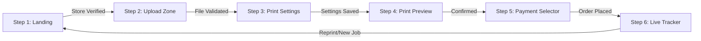

# Frontend Architecture & Client State Engine

## 1. Overview & Framework

The frontend is located under `/web` and built using:
- **Framework**: Next.js 14.2.11 (App Router, Server Components where applicable, Client Components for wizards).
- **UI Library**: React 18.3.1 with TypeScript 5.6.2.
- **Styling**: Tailwind CSS 3.4.11 with `clsx` and `tailwind-merge` utility helpers.
- **Icons**: `lucide-react` (SVG vector icon set).
- **Animations / Feedback**: `canvas-confetti` for celebratory completion states.

---

## 2. Customer Portal: 6-Stage State Machine (`PrintWizard.tsx`)

The customer kiosk interface is modeled as a strict finite state machine managed within `web/src/components/print/PrintWizard.tsx`:



| Step | State Key | Primary Component | Actions & Responsibilities |
| :---: | :--- | :--- | :--- |
| **1** | `1: Landing` | `StoreHeader.tsx` | Validates `?store={UUID}` parameter against Supabase `stores` table; displays shop name, address, and live per-page rates. |
| **2** | `2: Upload` | `UploadZone.tsx` | Drag-and-drop ingestion; validates extensions (`pdf, png, jpg, jpeg, webp, doc, docx`); runs `imageCompressor.ts` for photos and `pdfUtils.ts` for page counts. |
| **3** | `3: Settings` | `SettingsSheet.tsx` | Manages `DetailedPrintSettings` (Copies, Paper Size, Photo Size, Duplex, Margins, N-Up, Quality); auto-selects Color mode if photos are present. |
| **4** | `4: Preview` | `PrintPreview.tsx` | Renders canvas page previews; displays privacy reminder badges ("Zero-Disk Streaming Kiosk"). |
| **5** | `5: Payment` | `PaymentSelector.tsx` | Renders dynamic pricing breakdown; offers Razorpay UPI checkout or Pay Cash at Counter. |
| **6** | `6: Status` | `LiveTracker.tsx` | Connects to Supabase Realtime channel for order updates; displays animated status badges (`Pending Approval` $\rightarrow$ `Printing` $\rightarrow$ `Completed`). |

---

## 3. Core Component Breakdown

### 3.1 `UploadZone.tsx`
- Handles HTML5 drag-and-drop and standard file inputs.
- Client-side size guards: Enforces 50MB per-file ceiling.
- Formats file items into `UploadedFileItem`:
  - Name, size in bytes, formatted size string, MIME type, preview URL (`URL.createObjectURL`).
  - Progress bar indicator (0% to 100%).

### 3.2 `SettingsSheet.tsx`
- **Color Mode**: `bw` (Monochrome) vs `color` (Full Color).
- **Paper & Photo Sizes**: Standard sizes (`A4, Letter, Legal, A3, A5, B5, Custom`) or Photo sizes (`Full page, 8x10, 5x7, 4x6, 3.5x5, 2x3 Wallet, Custom`).
- **Layout & Margins**: Orientation (`portrait, landscape`), Margins (`normal, narrow, wide, none`), Alignment (`center, top-left`).
- **N-Up Multi-Page**: Pages per sheet (1, 2, 4, 6, 9) reducing paper consumption and adjusting price calculation.
- **Duplex Print**: Toggle with edge binding selection (`long` vs `short` edge).

### 3.3 `PaymentSelector.tsx`
- Renders detailed itemized cost breakdown:
  - Base per-page rate $\times$ effective pages.
  - Multipliers for paper size and print quality.
  - 10% duplex discount deduction when applicable.
- Two distinct payment execution triggers:
  1. **UPI / Online**: Calls `/api/payment/create-order`, launches Razorpay modal, verifies client signature.
  2. **Cash at Counter**: Updates job payment record to `cash` and sets job directly into storekeeper approval queue.

### 3.4 `LiveTracker.tsx`
- Real-time order tracker subscribing to:
  ```typescript
  supabase
    .channel(`public:print_jobs:id=eq.${job.id}`)
    .on('postgres_changes', { event: 'UPDATE', schema: 'public', table: 'print_jobs', filter: `id=eq.${job.id}` }, payload => {
      setJob(payload.new as PrintJobRecord);
    })
    .subscribe();
  ```
- Displays estimated completion progress, real-time animated spinner, and triggers confetti on `completed`.

---

## 4. Client Utilities (`/web/src/lib`)

### 4.1 `tokenManager.ts`
- Generates high-entropy 64-character hexadecimal tokens via `crypto.getRandomValues(new Uint8Array(32))`.
- Persists tokens to browser `localStorage` (`print_infinity_customer_token`).
- Injected into all API requests as the `x-customer-token` header to satisfy PostgreSQL RLS policies.

### 4.2 `imageCompressor.ts`
- Canvas-based client downscaler: Constrains uploaded mobile phone camera photos (often 10MB–25MB) to max 2400px bounding dimensions at 0.85 JPEG quality before upload, drastically reducing upload latency.

### 4.3 `pdfUtils.ts`
- Uses native ArrayBuffer parsing to extract the `/Count` tag from PDF trailer dictionaries for instant client-side page calculation without server round-trips.

---

## 5. Storekeeper Admin Portal (`/web/src/app/admin/page.tsx`)

A full-featured management dashboard for store owners:
- **Authentication**: Email/password authentication integrated with Supabase GoTrue Auth.
- **Store Configuration**: Edit shop name, address, active status, and custom per-page rates (`bw_price_per_page`, `color_price_per_page`).
- **Live Hardware Overview**: Displays all configured printers, online/offline status, type (`bw` / `color`), connection (`usb` / `wifi`), and priority order.
- **QR Code Generator**: Generates and prints shop-specific counter QR codes with direct deep links to the kiosk.
