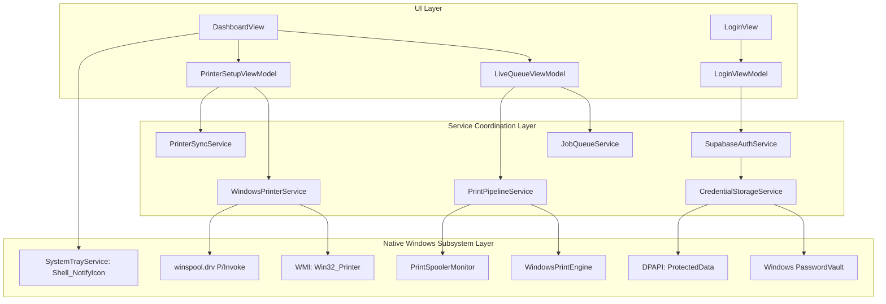

# Windows Native Agent Architecture

## 1. Overview & Framework

The Windows Agent runs natively on the print shop PC:
- **Target OS**: Windows 10 (v19041+) and Windows 11.
- **Architecture**: `win-x64` Self-Contained.
- **Framework**: .NET 8.0 with Windows App SDK 1.5 (WinUI 3).
- **Deployment Mode**: Unpackaged (no MSIX registration required; standard executable launched from `%LOCALAPPDATA%\Programs\PrintInfinityAgent`).
- **UI Architecture**: MVVM using `CommunityToolkit.Mvvm` (Source Generators for Observable Properties & Relay Commands).

---

## 2. Core Service Matrix (`PrintInfinity.Agent/Services`)



| Service | Primary Responsibility | Native Windows API Interacted With |
| :--- | :--- | :--- |
| `JobQueueService` | Listens to Supabase Realtime WebSocket changes; manages queue lifecycle. | Sockets / WebSocket / DispatcherQueue |
| `PrintPipelineService` | Coordinates background print channel; manages zero-disk in-memory streaming. | `System.Threading.Channels`, `SocketsHttpHandler` |
| `WindowsPrintEngine` | Renders PDF and image bytes directly in RAM; sends silent print to spooler. | `Windows.Data.Pdf.PdfDocument`, `System.Drawing.Printing` |
| `PrintSpoolerMonitor` | Monitors the physical spooler queue until completion or error. | `winspool.drv` (`OpenPrinter`, `EnumJobs`, `GetJob`) |
| `WindowsPrinterService` | Fast status polling (<0.1ms) and printer enumeration. | `winspool.drv` (`GetPrinter`), WMI (`Win32_Printer`) |
| `PrinterSyncService` | Merges local Windows printers with Supabase cloud printer database. | Supabase Postgrest REST Client |
| `CredentialStorageService` | Securely stores GoTrue session tokens and passwords on the PC. | Windows `PasswordVault`, DPAPI `ProtectedData` |
| `SystemTrayService` | Minimizes app to system tray; prevents accidental termination on ✕ click. | Win32 `Shell_NotifyIconW`, `ShowWindow(SW_HIDE)` |

---

## 3. Zero-Disk In-Memory Print Pipeline (`PrintPipelineService.cs`)

### 3.1 Worker Thread & Channel Queue
Jobs are placed into an unbounded single-reader channel:
```csharp
_channel = Channel.CreateUnbounded<PipelineTask>(new UnboundedChannelOptions { SingleReader = true });
_workerTask = Task.Run(ProcessQueueLoopAsync);
```
This guarantees FIFO execution and prevents multiple concurrent spooler allocations from overwhelming local printer memory buffers.

### 3.2 High-Performance HTTP Handler
To prevent Windows socket exhaustion during frequent print runs, a single static `HttpClient` is utilized:
```csharp
private static readonly HttpClient _httpClient = new HttpClient(new SocketsHttpHandler
{
    PooledConnectionLifetime = TimeSpan.FromMinutes(5),
    ConnectTimeout = TimeSpan.FromSeconds(10)
}) { Timeout = TimeSpan.FromSeconds(30) };
```

### 3.3 Zero-Disk Spooling Algorithm
```csharp
// Step 1: Download bytes directly into RAM buffer (never touching disk)
byte[] inMemoryBuffer = await _httpClient.GetByteArrayAsync(signedUrl);

// Step 2: Stream directly into WinRT in-memory stream
using var randomAccessStream = new InMemoryRandomAccessStream();
using (var writer = new DataWriter(randomAccessStream.GetOutputStreamAt(0)))
{
    writer.WriteBytes(inMemoryBuffer);
    await writer.StoreAsync();
}

// Step 3: Parse PDF directly from memory
var pdfDoc = await PdfDocument.LoadFromStreamAsync(randomAccessStream);

// Step 4: Spool using silent controller (no popups)
using var printDoc = new PrintDocument();
printDoc.PrintController = new StandardPrintController();
printDoc.Print();

// Step 5: Wait for hardware spooler confirmation
var spoolerResult = await _spoolerMonitor.WaitForJobCompletionAsync(printerName, docName, 90s);

// Step 6: SCRUB RAM BUFFER IMMEDIATELY
Array.Clear(inMemoryBuffer, 0, inMemoryBuffer.Length);
inMemoryBuffer = null;

// Step 7: DELETE CLOUD FILE IMMEDIATELY
await _authService.Client.Storage.From("print-uploads").Remove(new List<string> { storagePath });
```

---

## 4. Win32 Spooler Native Integration (`winspool.drv`)

`PrintSpoolerMonitor.cs` and `WindowsPrinterService.cs` communicate directly with the Windows Spooler subsystem via P/Invoke:

```csharp
[DllImport("winspool.drv", SetLastError = true, CharSet = CharSet.Auto)]
private static extern bool OpenPrinter(string pPrinterName, out IntPtr phPrinter, IntPtr pDefault);

[DllImport("winspool.drv", SetLastError = true)]
private static extern bool ClosePrinter(IntPtr hPrinter);

[DllImport("winspool.drv", SetLastError = true)]
private static extern bool EnumJobs(
    IntPtr hPrinter, uint FirstJob, uint NoJobs, uint Level,
    IntPtr pJob, uint cbBuf, out uint pcbNeeded, out uint pcReturned);
```

### Spooler Status Flags Intercepted:
- `JOB_STATUS_ERROR` (`0x00000002`): Hardware or driver fault.
- `JOB_STATUS_PAPEROUT` (`0x00000040`): Tray out of paper.
- `JOB_STATUS_OFFLINE` (`0x00000020`): Device disconnected during print.
- `JOB_STATUS_PRINTED` (`0x00000080`): Physical job output complete.
- `JOB_STATUS_DELETED` (`0x00000100`): Cancelled by user.

---

## 5. Background System Tray Persistence (`SystemTrayService.cs`)

- When the storekeeper clicks the **✕ (Close)** button on `MainWindow`, the event is intercepted via `AppWindow.Closing` (`args.Cancel = true`).
- The window is hidden from taskbar and desktop (`ShowWindow(hWnd, SW_HIDE)`).
- A 16x16 icon is maintained in the Windows notification area (`Shell_NotifyIconW`).
- Realtime listener remains fully active in the background. Incoming jobs trigger native Windows toast notifications.
- When the window is hidden, WMI polling is suspended (`PausePolling()`) to reduce PC CPU cycles to near 0%.
- Double-clicking the tray icon restores and foregrounds the window (`ShowWindow(hWnd, SW_RESTORE)`).
