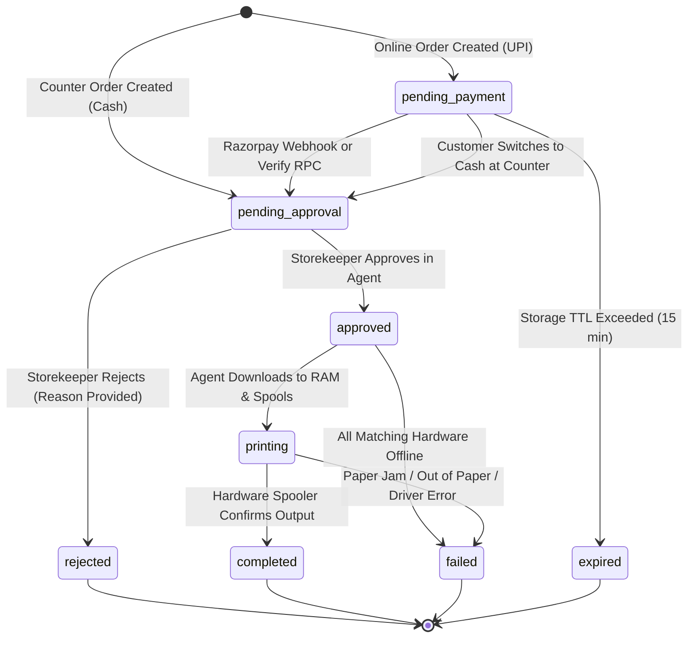
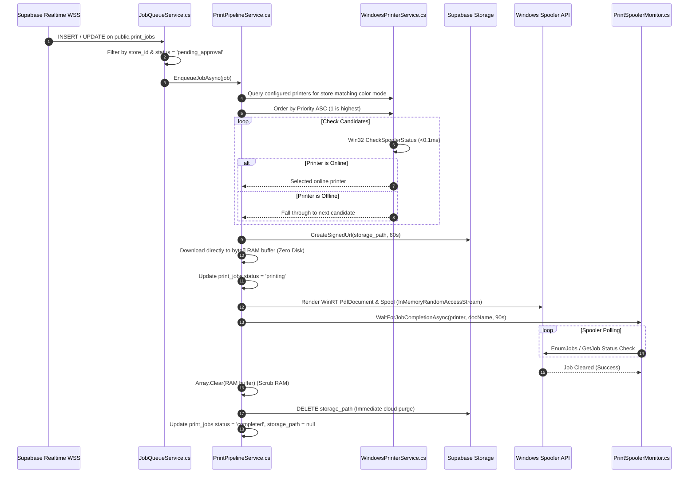

# System Workflows & State Lifecycles

## 1. Complete Print Job Lifecycle State Machine

A print job progresses through the following finite states:



---

## 2. Step-by-Step Operational Workflows

### 2.1 Customer Order Placement Workflow (`/web`)
1. **Entry**: Customer scans the store QR code: `https://printinfinity.in/print?store={STORE_UUID}`.
2. **Store Validation**: `PrintWizard.tsx` calls `GET /api/store/manage?store_id={UUID}` to verify store activity and fetch custom per-page rates (`bw_price_per_page`, `color_price_per_page`).
3. **Document Ingestion**:
   - Customer drops file into `UploadZone.tsx` (PDF, PNG, JPG, WEBP, DOCX; max 50MB).
   - If image: Client-side downscaling and compression via `imageCompressor.ts`.
   - If PDF: Client-side page count extraction via `pdfUtils.ts`.
4. **Settings & Dynamic Pricing**:
   - Customer customizes settings in `SettingsSheet.tsx` (Copies, Paper Size, Color Mode, Duplex, N-Up, Margins).
   - Formula evaluated in real-time (`pricing.ts`):
     $$\text{Sheets Needed} = \left\lceil \frac{\text{Total Pages}}{\text{Pages Per Sheet}} \right\rceil$$
     $$\text{Effective Pages} = \text{Sheets Needed} \times \text{Copies}$$
     $$\text{Subtotal} = \text{Effective Pages} \times \text{Base Rate} \times \text{Paper Multiplier} \times \text{Quality Multiplier}$$
     $$\text{Total} = \text{Subtotal} - \text{Duplex Discount (10\% if duplex \& sheets} > 1)$$
5. **Direct Storage Upload**:
   - Client generates cryptographic token `customer_token` via `tokenManager.ts`.
   - Uploads file directly to Supabase Storage private bucket `print-uploads/{UUID}/{filename}`.
6. **Job Registration**:
   - Client calls `POST /api/print-jobs/create`.
   - Next.js API enforces rate limiting (5 req/min per IP) and strict regex validations.
   - Inserts row in `public.print_jobs` with `storage_expires_at = NOW() + 15 minutes`.
   - Inserts row in `public.payments` (`status: pending`).

---

### 2.2 Payment Routing & Reconciliation

#### Scenario A: Online UPI via Razorpay
1. Client calls `POST /api/payment/create-order` $\rightarrow$ Next.js creates Razorpay Order in INR paise.
2. Razorpay Checkout modal renders on customer device.
3. Upon payment:
   - **Primary Path (Server Webhook)**: Razorpay hits `POST /api/payment/webhook`. Next.js validates `x-razorpay-signature` using HMAC-SHA256. If valid, updates `payments.status = 'verified'` and advances `print_jobs.status` from `pending_payment` to `pending_approval`.
   - **Secondary Path (Client Return)**: Client calls `POST /api/payment/verify` which invokes the PostgreSQL RPC `verify_payment_and_advance_job`.
   - **Idempotency Guard**: Both paths check `WHERE status = 'pending_payment'`. If the job has already advanced (e.g. storekeeper already approved), the current progressive status is safely retained.

#### Scenario B: Cash at Counter
1. Customer toggles "Pay Cash at Counter" in `PaymentSelector.tsx`.
2. Initial status is created directly as `pending_approval` (or in-flight orders call `POST /api/payment/switch-to-cash`).
3. Payment record marked as `method = 'cash'`, `gateway_ref = 'CASH_COUNTER'`.
4. The Windows Agent highlights the job card with a yellow **Cash at Counter** badge, and the action button displays **Collect Cash & Print**.

---

### 2.3 Desktop Agent Spooling & Zero-Disk Execution (`/windows-app`)



---

### 2.4 Automatic Printer Priority & Failover Algorithm
In `PrintPipelineService.cs`, physical printer selection uses a deterministic waterfall:
```csharp
// 1. Fetch cloud-registered printers matching job's color mode (bw or color)
var candidates = configuredPrinters
    .Where(p => p.Type == targetMode)
    .OrderBy(p => p.Priority > 0 ? p.Priority : 1)
    .ThenBy(p => p.Name)
    .ToList();

// 2. Fast Win32 spooler hardware check (< 0.1ms)
PrinterItem? selectedPrinter = null;
foreach (var candidate in candidates) {
    WindowsPrinterService.CheckSpoolerStatus(candidate);
    if (candidate.IsOnline) {
        selectedPrinter = candidate;
        break; // Pick highest-priority online printer
    }
}

// 3. Fallback: If all cloud-configured printers are offline, scan local Windows spoolers
if (selectedPrinter == null) {
    selectedPrinter = localInstalledPrinters
        .Where(p => p.Type == targetMode && p.IsOnline)
        .FirstOrDefault();
}

// 4. Fail-Safe: If no printer is online, mark job failed with a friendly shop alert
if (selectedPrinter == null) {
    job.Status = "failed";
    job.RejectionReason = $"All configured {targetMode} printers are offline. Please check power/paper.";
}
```

---

### 2.5 Auto-Cleanup & Expiry Engine
To enforce zero data retention:
1. **Normal Flow**: As soon as `PrintSpoolerMonitor` confirms the physical document has cleared the spooler, `PrintPipelineService` calls `Storage.From("print-uploads").Remove([storage_path])` and updates `storage_path = null`.
2. **Abandoned Flow**: Files uploaded by customers who abandon their cart are automatically expired by the database procedure `expire_outdated_print_jobs()` when `storage_expires_at < NOW()`, marking the job as `expired`.
