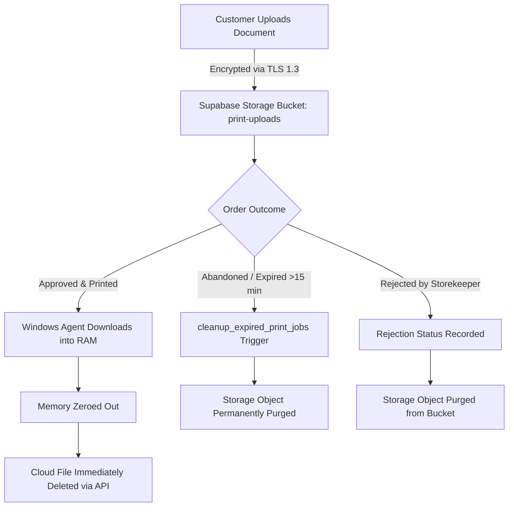

# Print Infinity — Data Privacy, Security & Retention Policy

**Document Version:** 1.0  
**Effective Date:** September 17, 2026  
**Scope:** Whole Platform (Web App, Next.js API, Supabase Cloud Infrastructure, Edge Functions, and Windows Agent Desktop Application)

---

## 1. Architecture & Privacy-First Philosophy

Print Infinity is engineered from the ground up on an **ephemeral, zero-disk footprint** architecture. In commercial print shops and public kiosks, customers routinely print sensitive, high-risk personal documents—including government photo IDs, passport scans, tax returns, bank statements, medical records, and legal contracts.

Print Infinity treats every uploaded document as **temporary, strictly confidential, and transient**. The system is architected so that customer document contents are never retained, never indexed, never thumbnailed, and never accessible beyond the specific, momentary physical print execution.

---

## 2. Complete Inventory of Customer Data Stored

| Data Category | Specific Fields | Storage Location | Retention Period | Deletion Mechanism |
| :--- | :--- | :--- | :--- | :--- |
| **Uploaded Document Files** | Binary file content (PDF, PNG, JPG, DOCX, etc.) | Private Supabase Storage (`print-uploads` bucket) | **Max 15 minutes** (or deleted instantly upon printing) | • Deleted immediately by Windows Agent on print completion • Purged automatically by `cleanup_expired_print_jobs()` after 15 min |
| **Print Job Parameters** | Color mode (`bw`/`color`), copies, paper size, page count, duplex | Supabase PostgreSQL (`public.print_jobs` table) | 30 days (operational audit trail) | Retained for merchant accounting; `storage_path` wiped immediately upon print completion |
| **Customer Token** | Ephemeral cryptographic token (`crypto.randomUUID()` / nanoid) | Customer browser `localStorage` & `print_jobs.customer_token` | Client session lifetime / 24 hours | Discarded upon session completion |
| **Payment Records** | Gateway payment ID, order ID, payment method (`cash`/`upi`), amount, timestamp | Supabase PostgreSQL (`public.payments` table) | 90 days (tax & accounting compliance) | Anonymized audit logs preserved without customer document associations |
| **Shopkeeper Credentials** | Storekeeper login email, authentication session tokens | Windows Credential Locker (`PasswordVault`) / DPAPI fallback | Stored until manual sign-out | Cleared securely via Windows Credential Manager |

---

## 3. Storage Security & Cryptographic Controls

### 3.1 Private Storage & Strict Row-Level Security (RLS)
- The Supabase Storage bucket `print-uploads` is **strictly private**. Public reads and unauthenticated bucket listings are disallowed.
- Row-Level Security (RLS) is enabled on all tables (`print_jobs`, `payments`, `stores`, `printers`, `storage.objects`).
- Storage upload policies enforce strict validation:
  - File extension allowlist: `.pdf`, `.png`, `.jpg`, `.jpeg`, `.webp`, `.doc`, `.docx`, `.ppt`, `.pptx`, `.xls`, `.xlsx`, `.txt`, `.rtf`.
  - Storage path format regex: `^[a-f0-9\-]{36}/[a-zA-Z0-9_\-]+\.[a-zA-Z0-9]+$`.
  - Verification that the target store ID exists and is currently active.

### 3.2 Short-Lived Signed URLs (≤ 60 Seconds)
- Download URLs for uploaded customer documents are **never static** and **never public**.
- When an approved print job is dispatched, the Windows Agent requests a fresh, short-lived signed URL with a maximum time-to-live (TTL) of **60 seconds**.
- Signed URLs are consumed directly in memory, are never logged to console or disk, and expire immediately after the single download request.

### 3.3 Zero-Disk In-Memory Spooling on Windows PC
- Traditional print shop software saves customer files into `C:\Users\...\Downloads` or `AppData\Local\Temp`, leaving confidential files recoverable by undelete utilities.
- **Print Infinity Agent implements Zero-Disk I/O**:
  1. File bytes are received over HTTPS directly into an in-memory `byte[]` buffer (`MemoryStream`).
  2. The document is decoded and rendered in RAM via `PDFiumCore`.
  3. Spool data is transmitted silently to the Windows GDI/Print Spooler API (`StartDocPrinter`, `StartPagePrinter`, `WritePrinter`).
  4. Immediately upon transfer, `Array.Clear(inMemoryBuffer, 0, inMemoryBuffer.Length)` is executed, zeroing out the memory buffer before garbage collection.

### 3.4 Zero-Thumbnail & Visual Privacy Policy
- To prevent shop staff or other customers standing nearby from viewing sensitive personal documents, the Windows Agent's queue card **does not render thumbnails or previews**.
- The storekeeper sees only operational parameters:
  - Color Mode (`B&W` or `Color`)
  - Copies & Total Pages
  - Paper Size
  - Total Price & Payment Status (`UPI Verified` or `Cash Pending`)

---

## 4. Document Deletion & Lifecycle Procedures

### 4.1 Lifecycle Timelines
1. **Immediate Deletion on Print Success (T + ~10 seconds):**  
   Once the document is sent to the physical printer spooler, the Windows Agent calls Supabase Storage `Remove([storage_path])` and sets `print_jobs.storage_path = NULL`.
2. **Automated Purge of Abandoned Uploads (T + 15 minutes):**  
   If a customer generates a print job or QR code but walks away without completing payment, the database procedure `public.cleanup_expired_print_jobs()` automatically identifies records where `now() > storage_expires_at` (15-minute window) and permanently purges the corresponding storage objects.
3. **Rejection Cleanup:**  
   If a storekeeper rejects an order (e.g. out of paper or unsupported media), the file is marked for immediate removal.

---

## 5. Threat Model & Abuse Prevention

### 5.1 Payment Gateway Secret Protection
- Razorpay API secret keys (`RAZORPAY_KEY_SECRET`, `RAZORPAY_WEBHOOK_SECRET`) reside **exclusively in server-side environment variables** (Supabase Edge Functions / Next.js Server Runtimes).
- The Next.js client bundle contains only the public merchant ID (`NEXT_PUBLIC_RAZORPAY_KEY_ID`).
- All webhook signatures are verified using strict HMAC-SHA256 with constant-time equality comparisons (`crypto.timingSafeEqual`) to prevent timing attacks.

### 5.2 Public QR Code & Endpoint Rate Limiting
- To protect public QR codes displayed at print counters from spam attacks or denial-of-service, multi-layered rate limiting is enforced:
  - **Server-Side Sliding-Window Limiter:** Maximum 5 print job submissions per 60 seconds per client IP address on `/api/print-jobs/create`.
  - **Database-Level Trigger:** `public.check_print_job_rate_limit()` enforces a hard cap of 5 jobs per minute per customer token and 60 jobs per minute across any single store.
  - **Payment Rate Limiter:** Maximum 5 order initiation calls per 60 seconds per IP on `/api/payment/create-order`.

### 5.3 Storekeeper Credential Protection
- Storekeeper credentials are saved exclusively via the **Windows Credential Locker** (`Windows.Security.Credentials.PasswordVault`), which encrypts credentials using the operating system's hardware-backed TPM or user profile keys.
- On legacy environments where Credential Locker is unavailable, credentials fall back to **Windows Data Protection API (DPAPI)** (`DataProtectionScope.CurrentUser`). Plaintext configuration files are strictly prohibited.

---

## 6. Summary of Compliance Posture

| Requirement | Implementation Detail | Status |
| :--- | :--- | :--- |
| **Data Minimization** | No customer names, phone numbers, or emails required to print | Enforced |
| **Ephemeral Document Storage** | Files deleted immediately after printing or after 15 min TTL | Enforced |
| **No Disk Persistence** | Zero customer files written to agent desktop storage | Enforced |
| **Confidentiality in Transit** | HTTPS / TLS 1.3 enforced on all communication channels | Enforced |
| **Strict Access Control** | RLS on every table; 60s single-use download tokens | Enforced |
| **Auditable Logging** | Text-only logs (timestamp, page count, printer name, status) | Enforced |
